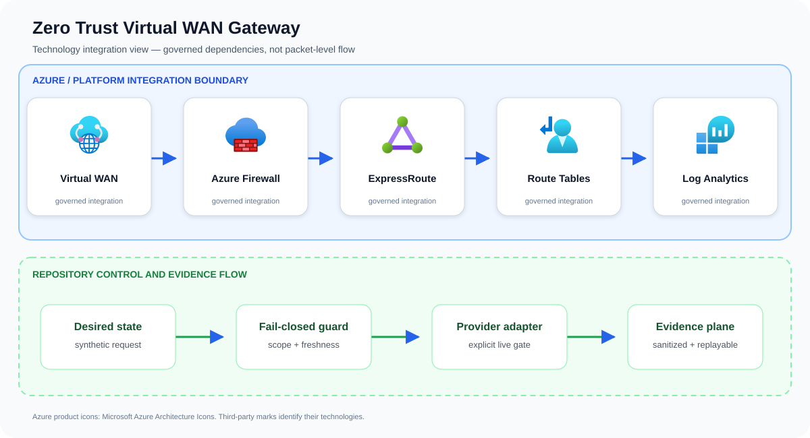

# Zero Trust Virtual WAN Gateway

A guarded, multi-region Azure Virtual WAN transit baseline. A deterministic
preflight validator rejects overlapping address space, non-Premium firewalls,
missing private or internet routing intent, permissive threat settings, wildcard
egress, incomplete TLS inspection, and stale exceptions before Bicep parameters
are produced.

The deployable slice creates a Standard Virtual WAN, two secured hubs, Azure
Firewall Premium policies, routing intent for private and internet traffic,
isolated spokes, private DNS links, and centralized firewall diagnostics. The
firewall policy has no broad east-west allow rule; approved HTTPS destinations
are explicit and TLS-inspected.

## Problem statement

A two-region Virtual WAN request is checked for private routing, secured hubs, Firewall Premium inspection, approved prefixes, and a pre-change route snapshot before producing deployable parameters.

A production implementation can still fail even when every resource deploys successfully. The material risk is accidental reachability: a valid operational need creates a broader or longer-lived path than intended. The design therefore treats Virtual WAN, Azure Firewall, ExpressRoute, and the surrounding identity and evidence controls as one reviewable system rather than unrelated configuration tasks.

## Example case study

### Situation

A multinational company is replacing inconsistent site-to-site VPN hubs with centrally governed transit. The gateway provides repeatable inspection and segmentation while documenting the routing-intent rollback boundary that teams often discover too late.

### Response

A multinational connects an acquired branch whose prefix overlaps an existing spoke. Preflight stops routing intent; after correction, private and internet traffic traverse Firewall Premium and the prior route snapshot remains available for rollback.

The team first exercises the repository's synthetic approved and denied fixtures. An approved request must produce the same idempotent plan on replay; a stale, unscoped, public, or unapproved request must fail before an Azure adapter is allowed to run.

### Expected outcome

Stakeholders receive a decision package they can attach to a change record: requested scope, controls evaluated, the reason for approval or denial, and the explicit handoff to live integration. The example supports design review and incident rehearsal without pretending that a local test changed Azure.

## Architecture



The upper boundary names the principal services and technologies used by this repository. The lower boundary shows the implemented control flow: desired state is validated, provider action remains an explicit integration gate, and sanitized evidence is retained for review and deterministic replay.

## Validate and render

Python 3.11+ is required; no third-party Python packages are used.

```bash
python3 src/topology.py validate --config config/topology.json
python3 src/topology.py render \
  --config config/topology.json \
  --output build/main.parameters.json
./scripts/validate.sh
```

Rendering is deterministic. The checked-in configuration is synthetic and
sets `deployTopology` to false.

## Deploy

Azure Firewall Premium and Virtual WAN are materially chargeable. Supply a
Key Vault secret containing the TLS inspection CA certificate and explicitly
opt in:

```bash
az deployment group what-if \
  --resource-group <disposable-rg> \
  --template-file infra/main.bicep \
  --parameters @build/main.parameters.json \
  --parameters deployTopology=true \
               tlsInspectionCertificateSecretId=<key-vault-secret-resource-id>
```

Export current hub route tables, gateways, and connections before enabling
routing intent. Removing routing intent does not reconstruct the old route
configuration. See the [runbook](docs/runbook.md).

## Boundaries

This project does not create branch/ExpressRoute circuits, production DNS
zones, certificates, Azure Policy assignments, Bastion, workloads, or a
failover orchestrator. Azure Bastion is excluded from the no-public-IP vertical
slice; use an approved private administration path or separately review
private-only Bastion Premium in the target region.

See [architecture](docs/architecture.md), [threat model](docs/threat-model.md),
[test matrix](docs/test-matrix.md), and [cost model](docs/cost-model.md).

## Repository guide

- [Architecture](docs/architecture.md)
- [Threat model](docs/threat-model.md)
- [Operations runbook](docs/runbook.md)
- [Test matrix](docs/test-matrix.md)
- [Cost model](docs/cost-model.md)
- [Security policy](SECURITY.md)
- [Contributing guide](CONTRIBUTING.md)
- [Support policy](SUPPORT.md)
- [Changelog](CHANGELOG.md)
- [License](LICENSE)

## Infrastructure inputs

Resource behavior and deploy-time values are intentionally separated:

- [Bicep template](infra/main.bicep) — Azure resources, modules, and security controls.
- [Bicep parameters](infra/main.bicepparam) — environment-specific names, regions, identities, and feature inputs.

Start with the parameter file's safe values, replace synthetic identifiers, and run an Azure what-if before deployment.

## Attribution

Azure product icons come from [Microsoft's official Azure Architecture Icons](https://learn.microsoft.com/azure/architecture/icons/). Open-source marks are sourced from [Simple Icons](https://simpleicons.org/) when shown; each mark identifies its respective technology.
