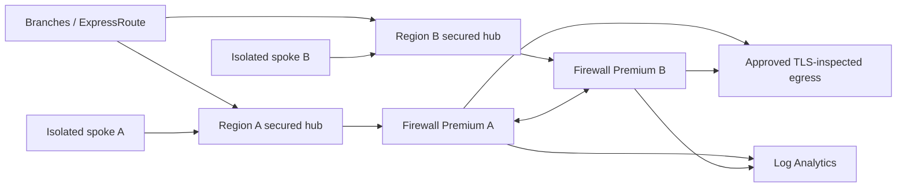

# Zero Trust Virtual WAN Gateway

A guarded, multi-region Azure Virtual WAN transit baseline. A deterministic
preflight validator rejects overlapping address space, non-Premium firewalls,
missing private or internet routing intent, permissive threat settings, wildcard
egress, incomplete TLS inspection, and stale exceptions before Bicep parameters
are produced.

The deployable slice creates a Standard Virtual WAN, two secured hubs, Azure
Firewall Premium policies, routing intent for private and internet traffic,
isolated spokes, private DNS links, and centralized firewall diagnostics. The
firewall policy has no broad east-west allow rule; approved HTTPS destinations
are explicit and TLS-inspected.

## Architecture



## Validate and render

Python 3.11+ is required; no third-party Python packages are used.

```bash
python3 src/topology.py validate --config config/topology.json
python3 src/topology.py render \
  --config config/topology.json \
  --output build/main.parameters.json
./scripts/validate.sh
```

Rendering is deterministic. The checked-in configuration is synthetic and
sets `deployTopology` to false.

## Deploy

Azure Firewall Premium and Virtual WAN are materially chargeable. Supply a
Key Vault secret containing the TLS inspection CA certificate and explicitly
opt in:

```bash
az deployment group what-if \
  --resource-group <disposable-rg> \
  --template-file infra/main.bicep \
  --parameters @build/main.parameters.json \
  --parameters deployTopology=true \
               tlsInspectionCertificateSecretId=<key-vault-secret-resource-id>
```

Export current hub route tables, gateways, and connections before enabling
routing intent. Removing routing intent does not reconstruct the old route
configuration. See the [runbook](docs/runbook.md).

## Boundaries

This project does not create branch/ExpressRoute circuits, production DNS
zones, certificates, Azure Policy assignments, Bastion, workloads, or a
failover orchestrator. Azure Bastion is excluded from the no-public-IP vertical
slice; use an approved private administration path or separately review
private-only Bastion Premium in the target region.

See [architecture](docs/architecture.md), [threat model](docs/threat-model.md),
[test matrix](docs/test-matrix.md), and [cost model](docs/cost-model.md).
